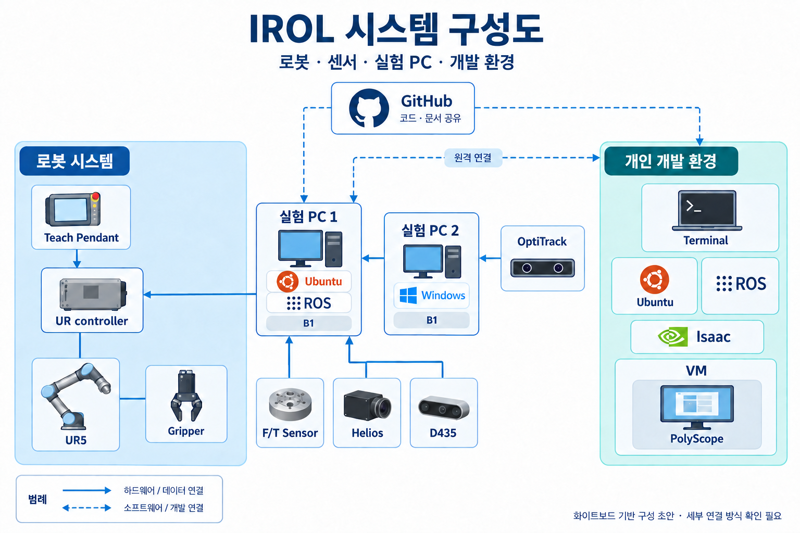

# IROL Instruction

IROL 팀의 실험 PC, 로봇, 센서 및 그리퍼를 처음부터 구성하고 운용하기 위한 안내서입니다. 관련 경험이 없는 신규 인원과 AI agent가 함께 사용할 수 있도록 설치 절차, 확인 방법과 트러블슈팅을 정리합니다.

> 현재는 담당자의 경험과 공식 문서를 바탕으로 내용을 작성하는 단계입니다. 실제 신규 설치로 확인하지 않은 절차는 각 문서에 `재검증 필요`로 표시합니다.

## 시스템 구성



현재 문서화 범위는 실험 PC와 실험 PC에 연결되는 로봇, 센서 및 그리퍼입니다. 개인 연구 PC와 Isaac 환경은 현재 범위에서 제외합니다.

## 기준 환경

| 항목 | 기준 |
| --- | --- |
| 실험 PC 운영체제 | Ubuntu 22.04 |
| ROS | ROS 2 Humble |
| GPU | NVIDIA GeForce RTX 4090 |
| 설치 완료 기준 | 센서 데이터의 ROS 2 토픽 수신 및 로봇 제어 가능 |

## 문서 바로가기

### Software

| 구성요소 | 문서 |
| --- | --- |
| Ubuntu | [Ubuntu 22.04 설치](./software/ubuntu/README.md) |
| ROS | [ROS 2 Humble 설치](./software/ros/README.md) |
| MoveIt | [MoveIt 설치 및 설정](./software/moveit/README.md) |
| Anaconda | [Anaconda 설치 및 설정](./software/anaconda/README.md) |

### Robot

| 구성요소 | 문서 |
| --- | --- |
| UR | [UR 로봇 설치 및 설정](./robot/ur/README.md) |

### Sensor

| 구성요소 | 문서 | 상태 |
| --- | --- | --- |
| LUCID Helios | [Helios](./sensor/helios/README.md) | 작성 예정 |
| Intel RealSense D435·D455 | [Intel RealSense](./sensor/realsense/README.md) | 작성 예정 |
| F/T 센서 | [F/T 센서](./sensor/ft-sensor/README.md) | 사용·검증 후 작성 |
| OptiTrack | [OptiTrack](./sensor/optitrack/README.md) | 작성 예정 |

### Gripper

| 구성요소 | 문서 | 상태 |
| --- | --- | --- |
| Robotiq 2F-85 | [Robotiq 2F-85](./gripper/robotiq-2f-85/README.md) | 작성 예정 |
| OnRobot suction gripper | [OnRobot suction gripper](./gripper/onrobot-suction/README.md) | 작성 예정 |
| Inspire Robots RH56E2 | [Inspire Robots RH56E2](./gripper/inspire-rh56e2/README.md) | 사용·검증 후 작성 |

## 권장 작성 및 설치 순서

1. Ubuntu 22.04와 NVIDIA 드라이버
2. ROS 2 Humble
3. UR 로봇과 기본 제어
4. MoveIt 및 RTDE 제어 경로
5. 센서별 드라이버와 ROS 2 토픽 확인
6. 그리퍼별 연결과 제어 확인
7. 전체 네트워크와 통합 실행 순서
8. 구성요소별 트러블슈팅과 자동화 가능성 검토

## 저장소 구조

```text
IROL-instruction/
├── README.md
├── assets/
├── software/
│   ├── README.md
│   ├── ubuntu/
│   ├── ros/
│   ├── moveit/
│   └── anaconda/
├── robot/
│   ├── README.md
│   └── ur/
├── sensor/
│   ├── README.md
│   ├── helios/
│   ├── realsense/
│   ├── ft-sensor/
│   └── optitrack/
└── gripper/
    ├── README.md
    ├── robotiq-2f-85/
    ├── onrobot-suction/
    └── inspire-rh56e2/
```

## 문서 작성 원칙

- 관련 지식이 없는 신규 인원을 기준으로 작성합니다.
- 실행할 위치, 명령, 입력값, 예상 결과와 성공 기준을 명확히 씁니다.
- 고정되지 않는 IP, 장치명과 경로는 값을 확인하는 방법도 함께 기록합니다.
- 실제로 겪은 오류는 증상 → 확인 → 원인 → 해결 → 재확인 순서로 기록합니다.
- 기억에 기반한 내용과 실제 재검증한 내용을 구분합니다.
- 비밀번호, 라이선스 키 등 민감한 실제 값은 저장소에 기록하지 않습니다.
