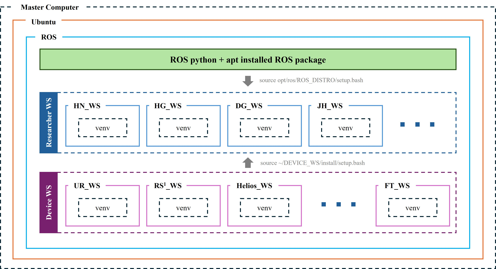

# ROS 2에서 여러 Python 가상환경으로 의존성 분리하기

[전체 안내로 돌아가기](../../README.md)



## 요약

**하나의 Ubuntu·ROS 2 기반을 유지하면서, 여러 Python 가상환경에 서로 다른 Python 패키지 구성을 설치하고, 각 환경에서 실행한 ROS 2 노드가 서로 통신하도록 구성할 수 있다.** [^ros-python]

다만 조건이 있다. apt로 설치한 ROS 2를 그대로 이용한다면, ROS 2 바이너리와 호환되는 Python 인터프리터 및 네이티브 라이브러리가 필요하다. 실험 PC에서는 우선 `/usr/bin/python3`로 만든 `venv`, 또는 동일한 시스템 인터프리터를 명시한 `uv venv`를 사용하는 구성이 적절하다. 이 권고는 공식 문서의 시스템 인터프리터 사용 조건에 따른 것이다.[^ros-python]

이 문서가 다루는 것은 **Python 패키지 구성의 분리와 프로세스별 실행 환경 선택**이다. 시스템 전체 복제, apt 패키지의 환경별 독립 설치, 커널·장치 드라이버의 분리, 실물 장비의 상태 복구까지 해결하는 방법은 아니다.

## 1. 논의의 출발점과 이번 문서의 범위

본 문서는 그 **분리 가능성이라는 방향을 유지하되, 경로 설정·바이너리 호환성·실제 실행 인터프리터에 관한 설명을 외부 자료로 교정한 기술 보충 문서**다. 

관련 문서는 다음과 같다.

| 관련 문서 | 이 문서와의 관계 |
| --- | --- |
| [서로 다른 컴퓨터 간 ROS 환경 이식 및 빌드](../../ROS_env_deploy.md) | 컴퓨터 사이의 재구성 문제를 다룬다. 본 문서는 한 기반 환경에서 여러 Python 환경을 사용하는 문제를 다룬다. |
| [Anaconda 설치 및 설정](../anaconda/README.md) | Conda 설치 자체와, apt ROS를 Conda Python에서 직접 사용하는 문제를 구분해야 한다. |
| [환경 자동화의 가능 범위와 잔여 허들](../../automation_hurdles.md) | Python 환경 분리를 장치·시스템 전체의 격리와 혼동하지 않는다. |

## 2. ROS 2 통신 구조: DDS

ROS 2는 Ubuntu와 같은 운영체제 위에서 실행되는 라이브러리·도구·프로세스의 집합이다. Humble의 일반적인 통신 구성에서는 **DDS(Data Distribution Service)** 기반 미들웨어를 사용한다. [^middleware][^domain]

Python 노드를 기준으로 단순화하면 다음과 같다.

```text
Python 노드 프로세스
  └─ rclpy: Python 클라이언트 라이브러리
      └─ 컴파일된 Python 확장 모듈
          └─ rcl: 공통 클라이언트 계층
              └─ rmw: 미들웨어 추상화 인터페이스
                  └─ DDS 구현과 그 통신 기능
```

C++ 노드는 일반적으로 `rclcpp`를 사용한다. 여기서 중요한 것은 **각 노드가 필요한 라이브러리를 자신의 프로세스에서 사용한다는 점**이다. 모든 프로그램이 하나의 중앙 Python 인터프리터나 단일 DDS 서버에 접속해야 하는 구조가 아니다. 기본적인 DDS discovery는 분산 방식이다. 별도로 discovery server를 구성하는 경우와도 구분해야 한다.[^middleware][^dds-design][^rclpy-build]

따라서 아래와 같은 구성이 가능하다.

```text
공통 기반: Ubuntu + ROS 2 Humble + 호환되는 네이티브 라이브러리

프로세스 A                         프로세스 B
  venv A의 Python                   venv B의 Python
  프로젝트 A의 Python 의존성        프로젝트 B의 Python 의존성
  공통 ROS의 rclpy                   공통 ROS의 rclpy
       │                                │
       └──────── ROS 2 통신 ─────────────┘
                  │
            C++ 드라이버 노드
```

이 구조에서 두 Python 프로세스가 같은 Python 패키지 버전을 전부 공유할 필요는 없다. 대신 각각의 프로세스 내부에서 의존성이 성립해야 하고, 통신에서는 토픽·메시지 타입·QoS·discovery 설정 등이 맞아야 한다. 가상환경 분리와 ROS 통신 설정은 서로 다른 축의 문제다.[^middleware][^domain][^qos]

## 3. `/opt/ros/humble`의 Python 패키지는 어떻게 보이는가

### 3.1. `sys.path`

사용자가 제공한 실행 결과에서는 `/usr/bin/python3`를 실행했을 때 다음 경로가 `sys.path`에 포함되어 있었다.

```text
/opt/ros/humble/lib/python3.10/site-packages
/opt/ros/humble/local/lib/python3.10/dist-packages
/usr/lib/python310.zip
/usr/lib/python3.10
/usr/lib/python3.10/lib-dynload
/home/min/.local/lib/python3.10/site-packages
/usr/local/lib/python3.10/dist-packages
/usr/lib/python3/dist-packages
```

이는 **해당 Python 프로세스가 모듈을 찾을 때 조사하는 디렉터리 목록에 ROS 설치 경로도 들어 있었다**는 뜻이다. 

### 3.2. “Python 패키지는 인터프리터에 설치되지 않는다”

Python 패키지는 선택한 인터프리터·환경의 설치 규칙에 따라 디렉터리에 설치된다. 실행 중인 Python은 `sys.path`에 있는 디렉터리를 검색하여 패키지를 불러온다. ROS 설치 경로를 그 검색 대상에 추가하면, 호환되는 가상환경에서도 공통 ROS 패키지를 참조할 수 있다.

이 때문에 패키지 설치에는 **사용할 Python을 명시한 명령**을 쓰는 것이 좋다. 아래는 명령 형식이며, `requirements.txt`는 해당 프로젝트에서 준비한 파일이다.

```bash
/path/to/venv/bin/python -m pip install -r requirements.txt
```

## 4. 가장 중요한 제한: 경로가 보여도 바이너리가 호환되어야 한다

### 4.1. `rclpy`는 순수 Python 코드만으로 구성되지 않는다

Humble의 `rclpy` 빌드 설정은 Python 인터프리터와 개발 구성요소를 찾고, `pybind11`을 사용해 `_rclpy_pybind11` 확장 모듈을 빌드한다. 이 확장 모듈은 `rcl` 등의 네이티브 라이브러리와 연결된다.[^rclpy-build]

따라서 필요한 조건은 단순히 다음 하나가 아니다.

```text
ROS의 .py 파일을 검색할 수 있다.
```

적어도 다음 조건들이 함께 성립해야 한다.

```text
Python 모듈 검색 경로가 맞는다.
+ Python 확장 모듈이 현재 인터프리터의 ABI와 호환된다.
+ 필요한 ROS·C/C++ 공유 라이브러리를 올바르게 로드한다.
+ 같은 프로세스 안에서 쓰는 다른 패키지의 요구 조건도 만족한다.
```

[^middleware][^rosidl-python]

### 4.2. Python 버전 일치

**apt ROS 2 Humble의 CPython 3.10용 바이너리를 그대로 사용하는 구성에서는, CPython 3.10과의 ABI 호환성이 필요한 조건이다.** Python 3.11이나 3.12에서 `/opt/ros/humble`의 Python 경로만 추가하는 방법으로 이 제한을 해결할 수 없다.[^ros-python][^python-abi]

반면 패치 버전까지 무조건 같아야 한다는 뜻은 아니다. CPython 공식 문서는 동일한 빌드 조건에서 같은 minor 계열의 ABI 호환성을 설명한다. 예를 들어 `3.10.x` 내부의 패치 차이와 `3.10 → 3.11` 변경은 구분해야 한다. 다만 같은 `3.10`이라는 숫자만으로 다른 배포판·빌드 설정·외부 라이브러리까지 전부 호환된다고 보장할 수는 없다.[^python-abi]

일부 확장에는 여러 Python minor 버전에 걸쳐 사용할 수 있는 Stable ABI라는 별도 방식이 있다. 그러나 이를 근거로 Humble의 `rclpy` 바이너리가 다른 minor 버전에서도 동작한다고 가정해서는 안 된다.[^python-abi][^rclpy-build]

연구실에서 apt ROS를 그대로 쓸 때는 **ROS 설치에 대응하는 `/usr/bin/python3`를 가상환경의 기반으로 지정하는 방식**이 가장 명확하다. 이 방식은 ROS 공식 문서의 안내와도 일치한다.[^ros-python]

## 5. 무엇을 분리할 수 있고, 무엇은 공유되는가

| 대상 | 가상환경으로 가능한 범위 | 남는 조건 |
| --- | --- | --- |
| 프로젝트별 Python 패키지 버전 | 서로 다른 환경에 설치하고 각각의 프로세스로 실행할 수 있다. | 각 환경 내부의 의존성은 성립해야 한다. |
| 공통 ROS Python 패키지 | 호환되는 여러 환경에서 같은 설치 경로를 참조할 수 있다. | Python ABI와 네이티브 라이브러리 호환성이 필요하다. |
| ROS 워크스페이스 | 프로젝트별로 구성·빌드·선택할 수 있다. | 워크스페이스 분리는 Python 환경 분리와 동일하지 않다. |
| Python wheel에 포함된 네이티브 코드 | 환경별로 다른 파일을 배치할 수 있는 경우가 있다. | 로드되는 C/C++ 런타임과 다른 확장 모듈의 ABI 충돌은 별도다. |
| apt로 설치한 시스템 라이브러리·SDK | `venv`를 바꾼다고 별도 설치 상태가 생기지 않는다. | 공통 시스템 상태를 함께 사용한다. |
| 커널·GPU 드라이버·USB 권한·네트워크·장비 전원 | 이 방식의 분리 대상이 아니다. | 별도 설치·운영·점검 절차가 필요하다. |

이 구분은 Python 가상환경의 범위, ROS 바이너리의 연결 관계, 동적 라이브러리 로딩 구조에서 도출되는 운영상 구분이다.[^pep405][^rclpy-build][^loader]

**격리의 단위는 “각각의 프로세스가 어떤 환경으로 실행되는가”다.** 한 Python 프로세스에서 충돌하는 두 프로젝트를 모두 import해 놓고, 가상환경 폴더만 둘로 나눈다고 문제가 해결되지는 않는다. 서로 다른 환경을 쓰려면 해당 부분을 별도 프로세스로 실행하는 설계가 필요하다.

## 6. `venv`, `uv`, Conda를 같은 조건으로 취급하면 안 된다

| 구성 | apt ROS를 공유하는 실험 PC에서의 판단 |
| --- | --- |
| `/usr/bin/python3 -m venv ...` | **우선 권장.** 시스템 인터프리터를 기반으로 프로젝트 패키지를 분리한다. |
| `uv venv --python /usr/bin/python3 ...` | **권장 가능한 대안.** 기반 인터프리터를 명시하면 같은 방향의 구성이 가능하다. |
| Python 버전 숫자만 지정한 `uv venv` | 실제로 어떤 Python 배포본이 선택되었는지 추가 확인한다. uv가 관리하는 별도 Python이 선택될 수 있다. |
| Conda Python + `/opt/ros/humble` 경로 주입 | **일반적인 표준 구성으로 권장하지 않는다.** 공식 ROS 문서가 바이너리 비호환 가능성을 경고한다. |
| RoboStack 등으로 ROS 자체도 Conda 환경에 설치 | 별도의 일관된 스택을 만드는 대안이다. apt ROS 공유 방식과 구분한다. |
| 다른 Python의 연산 프로세스 + 시스템 Python의 ROS 어댑터 | 서로 다른 Python·런타임이 필요한 경우 검토할 수 있는 구조적 대안이다. |

`venv`는 보통 기존 Python 실행 파일의 복사본 또는 심볼릭 링크와 별도 패키지 경로를 만든다. 따라서 “가상환경마다 완전히 다른 Python 배포본을 설치해야 한다”는 뜻은 아니다.[^pep405]

uv에서는 다음처럼 실행 파일 자체를 명시한다. 아래 두 환경 중 필요한 것 하나만 생성하면 된다.[^uv-env][^uv-cli]

```bash
# 순수 venv 방식
/usr/bin/python3 -m venv --system-site-packages "$HOME/.venvs/irol_ros"

# uv 방식: uv가 이미 설치되어 있다는 전제
uv venv --python /usr/bin/python3 --system-site-packages \
  "$HOME/.venvs/irol_ros_uv"
```

Conda에서 Python을 `3.10`으로 지정했다고 해서 apt ROS와의 직접 연동이 검증된 것은 아니다. 정확한 인터프리터 배포본과 공유 라이브러리 로딩까지 확인해야 한다. 반대로 특정 Conda 조합이 동작하는 사례가 있다는 이유로 Conda 자체가 항상 불가능하다고 단정할 필요도 없다. **가능한 특정 조합과 일반적으로 권장할 수 있는 구성을 구분한다.**[^ros-python][^loader]

RoboStack은 ROS를 Conda 계열 환경에 제공하는 별도의 경로다. 그 공식 안내는 기존 apt ROS의 `setup`을 함께 source하지 말라고 명시한다. 따라서 RoboStack을 선택했다면 `/opt/ros/humble`과 섞어서 문제를 해결하려 하지 않는다.[^robostack]

## 참고 자료와 근거

ROS 공식 설명 페이지 일부는 자료 확인 당시 접근 제한이 있어, ROS 프로젝트가 직접 공개하는 Humble 브랜치의 문서 소스를 확인했다. 아래 ROS 문서 링크는 해당 확인 경로다. 소스 코드의 `master` 참조 부분은 실험 PC에 설치된 패키지 버전과 차이가 있을 수 있으므로 구분한다.

[^ros-python]: ROS 2 공식 문서, Humble 「Using Python Packages with ROS 2」. 기존 바이너리와 Python 인터프리터의 일치, 시스템 Python 기반 가상환경, Conda 비호환 위험, `COLCON_IGNORE` 안내. [문서 소스](https://github.com/ros2/ros2_documentation/blob/humble/source/How-To-Guides/Using-Python-Packages.rst)

[^middleware]: ROS 2 공식 문서, Humble 「ROS 2 middleware implementations」. RMW·DDS 구현, 인터페이스 생성과 타입 지원. [문서 소스](https://github.com/ros2/ros2_documentation/blob/humble/source/Concepts/Advanced/About-Middleware-Implementations.rst)

[^dds-design]: ROS 2 설계 자료 「ROS on DDS」. DDS의 분산 discovery와 클라이언트 라이브러리 설계 배경. 초기 설계 문서이므로 현재의 개별 구현에 대해서는 Humble 문서·소스를 함께 참조했다. [설계 자료](https://design.ros2.org/articles/ros_on_dds.html)

[^domain]: ROS 2 공식 문서, Humble 「The ROS_DOMAIN_ID」. Domain ID와 discovery·통신 범위의 관계. [문서 소스](https://github.com/ros2/ros2_documentation/blob/humble/source/Concepts/Intermediate/About-Domain-ID.rst)

[^qos]: ROS 2 공식 문서, Humble 「Quality of Service settings」. QoS 호환성과 통신 성립 조건. [문서 소스](https://github.com/ros2/ros2_documentation/blob/humble/source/Concepts/Intermediate/About-Quality-of-Service-Settings.rst)

[^ros-env]: ROS 2 공식 문서, Humble 「Configuring environment」. `ROS_LOCALHOST_ONLY` 등 실행 환경 설정. [문서 소스](https://github.com/ros2/ros2_documentation/blob/humble/source/Tutorials/Beginner-CLI-Tools/Configuring-ROS2-Environment.rst)

[^python-sys]: Python 3.10 공식 문서, `sys`. `sys.path`, `sys.executable`, 환경 prefix. [공식 문서](https://docs.python.org/3.10/library/sys.html)

[^venv]: Python 3.10 공식 문서, `venv`. 기반 Python, 패키지 디렉터리, 시스템 site 참조, shebang, 환경 재생성. [공식 문서](https://docs.python.org/3.10/library/venv.html)

[^pep405]: Python 공식 PEP 405 「Python Virtual Environments」. 기반 인터프리터와 환경별 설치 경로의 분리, 시스템 site 공유의 설계 근거. [PEP 문서](https://peps.python.org/pep-0405/)

[^python-site]: Python 3.10 공식 문서, `site`. 사용자 site와 `PYTHONNOUSERSITE`, 가상환경의 site 구성. [공식 문서](https://docs.python.org/3.10/library/site.html)

[^python-abi]: Python 3.10 공식 문서 「C API Stability」. 동일 minor 계열 ABI와 Stable ABI 조건. [공식 문서](https://docs.python.org/3.10/c-api/stable.html)

[^rclpy-build]: ROS 2 `rclpy`, Humble의 `CMakeLists.txt`. `Python3`, `pybind11`, `_rclpy_pybind11`, 네이티브 라이브러리 연결의 구현 근거. [소스 코드](https://github.com/ros2/rclpy/blob/humble/rclpy/CMakeLists.txt)

[^rosidl-python]: ROS 2 `rosidl_python`, Humble. Python 메시지 생성과 확장 모듈 빌드. [소스 코드](https://github.com/ros2/rosidl_python/blob/humble/rosidl_generator_py/cmake/rosidl_generator_py_generate_interfaces.cmake)

[^colcon-env]: colcon 공식 문서 「Environment setup」. source, `PYTHONPATH`, `PATH`, 라이브러리 검색 경로, 워크스페이스 설정 스크립트. [공식 문서](https://colcon.readthedocs.io/en/released/developer/environment.html)

[^ament-index]: ROS 2 `ament_index`, Humble. `AMENT_PREFIX_PATH`를 이용하는 prefix 검색. [소스 코드](https://github.com/ament/ament_index/blob/humble/ament_index_python/ament_index_python/search_paths.py)

[^loader]: Linux man-pages, `ld.so(8)`. 공유 라이브러리 로딩과 `LD_LIBRARY_PATH`, RPATH 등의 검색 규칙. [매뉴얼](https://man7.org/linux/man-pages/man8/ld.so.8.html)

[^uv-env]: Astral uv 공식 문서 「Using environments」. 환경 생성과 대상 Python 지정. [공식 문서](https://docs.astral.sh/uv/pip/environments/)

[^uv-cli]: Astral uv 공식 CLI 안내, `uv venv`. `--python`, `--system-site-packages`, 시스템 site 런타임 참조와 uv 관리 대상의 차이. [공식 문서](https://docs.astral.sh/uv/reference/cli/#uv-venv)

[^robostack]: RoboStack 공식 「Getting Started」. Conda 계열 ROS 환경 구성과 기존 apt ROS를 source하지 말라는 주의. [공식 문서](https://robostack.github.io/GettingStarted.html)

[^ros2run]: ROS 2 `ros2cli`, Humble의 `ros2run` 구현. `run_executable()`이 실행 파일을 자식 프로세스로 시작한다는 근거. [소스 코드](https://github.com/ros2/ros2cli/blob/humble/ros2run/ros2run/api/__init__.py)

[^colcon-python]: colcon-core, `task/python/build.py`. Python 빌드 명령에서 `sys.executable`을 사용하는 구현. 자료 확인 시점의 공개 `master`이며 실험 PC의 설치 버전은 별도로 기록한다. [소스 코드](https://github.com/colcon/colcon-core/blob/master/colcon_core/task/python/build.py)

[^cmake-python]: CMake 공식 문서, `FindPython3`. `Python3_EXECUTABLE` 지정. [공식 문서](https://cmake.org/cmake/help/latest/module/FindPython3.html)

[^numpy]: NumPy 공식 「Troubleshooting」의 C API/ABI incompatibility 설명. Python 확장과 NumPy 비호환 사례. [공식 문서](https://numpy.org/doc/stable/user/troubleshooting-importerror.html)

[^pip-freeze]: pip 공식 문서, `pip freeze`. `--local`과 설치 상태 스냅샷의 한계. [공식 문서](https://pip.pypa.io/en/stable/cli/pip_freeze/)

[^packaging]: PyPI 배포 정보. [packaging 23.2](https://pypi.org/project/packaging/23.2/) / [packaging 24.2](https://pypi.org/project/packaging/24.2/)
